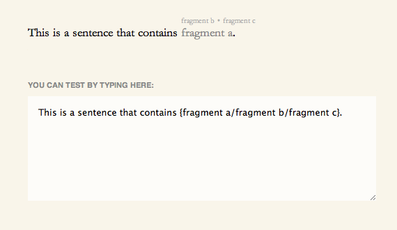

AuditionText
============

Show and switch between different phrases in your writing. [Here's a live demo.](http://tanmade.com/making/audition-text/)

## Syntax

This works by looking for strings formatted like so:

`This is a sentence that contains {fragment a/fragment b/fragment c}.`

## Caveats

This is all very janky / proof-of-concept so feel free to MAKE THIS BETTER. For example, the function will allow you to insert HTML and do all kinds of mean things. I guess you could strip out the < and > characters or something – YOU TELL ME, SMARTYPANTS.
